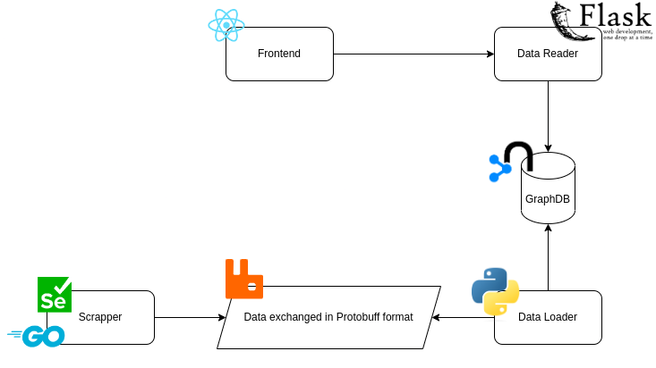
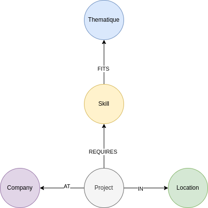
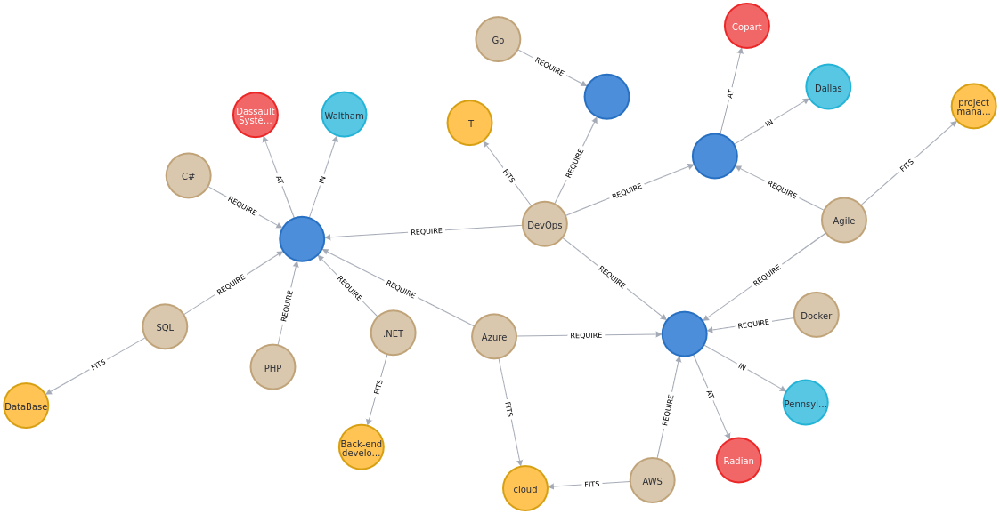

# PFE SEARCH ENGINE

A search engine for final year internships.

## Components

- __Backend:__ Implemented using Flask, and consists of two parts; the Data Reader and the Data Loader.
- __Frontend:__ Implemented with ReactJS. It consists of a search bar and a search filter. Once you execute the search, a list of the offers that correspond to your search will be returned. It queries the result from the Data Reader.
- __Scrapper:__ Implemented  with Python and the Selenium APIs. It is used to scrap job offers to load them to the database using the Data Loader.
- __Database:__ We use Neo4J for our database. Having a Graph Database enables us to define perfectly the relations between the data.

## Workflow

The current workflow is the following;

## Node-Relationship model

The following _Node-Relationship_ model is defined as the following;

Thus, the database looks like the following;

## Next Steps

- [ ] Convert the scapping scripts to go and dockerize it.
- [ ] Use RabbitMQ between the scrapper and the loader.
- [ ] Seperate the backend to two different containers, one for the reader and one for the loader.
- [ ] Use K8S for deployment.
- [ ] Use Helm to package the different entities.
- [ ] Add application metrics and visualize them using Prometheus and Grafana.
- [ ] Save logs.
- [ ] Improve the front's UI.
- [ ] Add UTs
- [ ] Add a CI/CD pipeline.
- [ ] Learn and apply security best practices.
